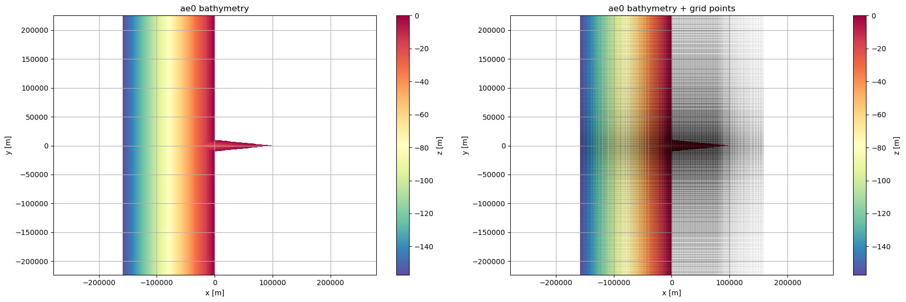
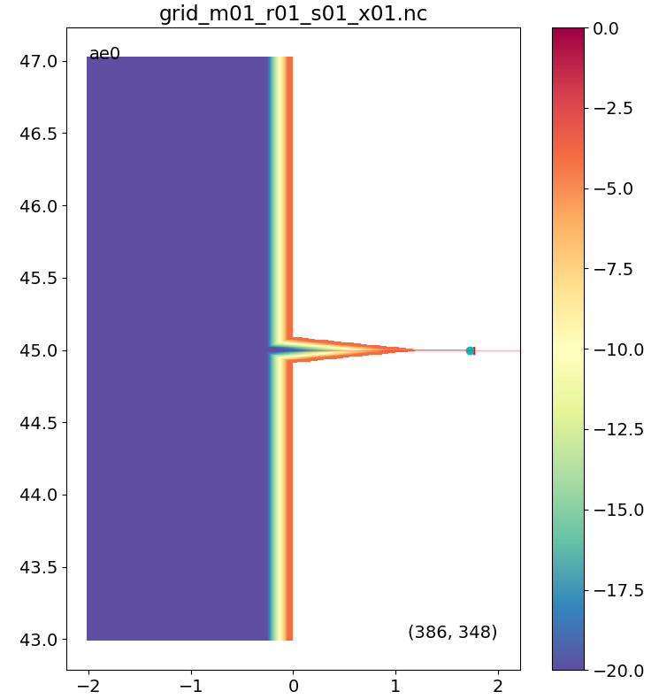

## Successful idealized runs!  
My goal for my first idealized estuary mini experiment was to investigate how tides propogate into an estuary as bathymetry shallows. In practicing setting up for a run, I also ran the "default" version with river forcing, which will provide a nice comparison point.

I successfully ran two versions of forcing on the `ae0` idealized estuary grid, one with and one without river input: 
| Forcing | t0 | tnoriv |
| --- | --- | --- |
| **River** | flow rate = 1000 m3 s-1 | **flow rate = 0 m3 s-1**|
|       | salinity = 0 | same...
|       | temp = 10
| **Ocean** at t=0| salinity = 30 everywhere (including in estuary)
|       | temp = 10 
| **Tides** | period = 12.42 hrs 

Atmospheric forcing and biology are turned off.   
I ran this over 2 weeks: from 2020.01.01 to 2020.01.15.

### Idealized estuary grid
The creation of the grid used `gfu.stretched_grid()` which creates high resolution (small grid spacing) in the central region of the grid and low resolution (larger grid spacing) towards the edges so as to not "waste" points outside the region of focus. The idealized estuary is centered at a latitude of 45 deg and longitude of 0 deg, with a river track at 45 degrees. For our grid, the resolution was defined to 500 m cells around the estuary area of focus (longitude 0 to 1, latitude 44.9 to 45.1) and 2500 m otherwise. 
  

Here the z scale is maxed out at 20 m so you can better see the estuary bathymetry:   
   
**Along estuary**, the depth shallows at a rate of $\frac{dz}{dx} = \frac{20}{100,000} = 0.0002$. This would give a depth of 0 at 100km, however the last quarter of the estuary (at x = 75 km) has been set to a constant depth of 5 m where the river track comes in.  
**Across estuary**, the depth shallows more rapidly at a rate of $\frac{dz}{dx} = \frac{20}{10,000} = 0.002$.  
**The estuary is 100 km long with a mouth 20 km across.**
### Initial plots
<video src="https://github.com/tiabottger/tiabottger.github.io/_posts/figures/2026.01.20/ae0_t0_xa0.mp4" controls="controls" style="max-width: 700px;"></video>
<video src="https://github.com/tiabottger/tiabottger.github.io/_posts/figures/2026.01.20/ae0_tnoriv_xa0.mp4" controls="controls" style="max-width: 700px;"></video>
I had fun digging into existing plotting code and modifying it for my idealized grid! These initial movies show that my forcing conditions worked-- there is no river input and salinity remains at zero for the tnoriv run.  
### Some theory and thoughts
#### Resonance
A simple formula can be used to determine resonant period given a depth and wavelength in a system:  
$T = \frac{4L}{\sqrt{gh}}$  
in which L is estuary length and h is the mean depth of the estuary. For a mean depth of about 10 m, this would give an estuary with a resonant period of about 1.11 hours. If tidal forcing were to match this period, we would expect resonance for this estuary and runaway tidal amplitudes. Those would be really quick tides (a tidal period is around 12.42 hours), so our estuary is in the clear-- we won't see amplitudes getting away from us! 
 
#### Sea surface height  
I'd like to plot a time series of sea surface height at several extractions along the lat = 45 degree estuary midline:
- boundary lon = -2: to confirm tidal forcing
- estuary mouth lon = 0: should be consistent with my forcing
- middle of the estuary lon = 0.5
- river lon = 1.1

I'm looking to see a phase shift and amplitude increase as the bathymetry shallows. 

#### Velocities
Estuaries are a machine for amplifying tidal currents because they are so shallow, however as tides propogate further into the estuary frictional forces. I'd expect velocities to be at a max at some intermediate value
